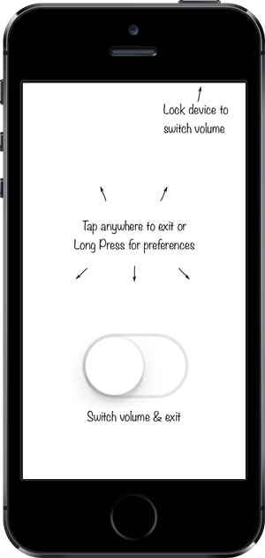

## FastVolume

It's too difficult to hear ringer at street. But keeping loud volume all the time is also not possible.

Application provides fast way (on non-jailbroken device) to switch between quiet and loud ringer volumes (adjusted in application's preferences, 5 and 10 bars by default). Uses iOS Private API.

Volume automatically adjusted (if necessary) to nearest value on every launch and resume from background.

Application has immediately suspended after volume switch or tap anywhere in view. Volume also will be toggled if you lock device while application is active. That's why it's *Fast* - require as few user actions as possible.

*Today widget* is available on iOS8.

### Changes

<dl>
    <dt>v1.2.0</dt>
    <dd>Preferences are available by long press.</dd>

    <dt>v1.1.1</dt>
    <dd>Today widget on iOS8 for even faster volume toggle!</dd>

    <dt>v1.0.6</dt>
    <dd>Low volume is 5 bars now</dd>

    <dt>v1.0.5</dt>
    <dd>Help. Screenshot.</dd>

    <dt>v1.0.4</dt>
    <dd>Automatically toggle volume if you lock device while application is active.</dd>

    <dt>v1.0.3</dt>
    <dd>Switch is x3 larger.</dd>
</dl>
